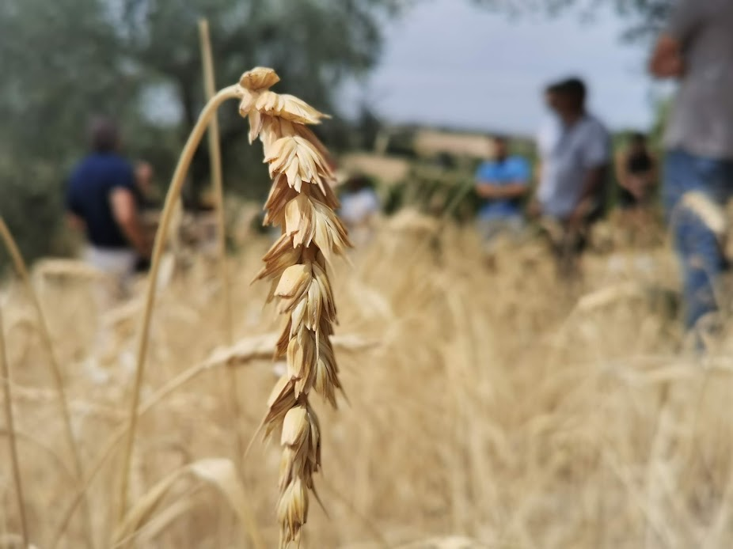

--- 
title: "A Participatory Plant Breeding Toolkit in R and RStudio"
author: "By Sergio Castro and Matteo Petitti"
date: "Last Update: 2021-10-19"
site: bookdown::bookdown_site
documentclass: book
bibliography: [book.bib, packages.bib]
biblio-style: apalike
link-citations: yes
header-includes:
  - \usepackage{titling}
  - \pretitle{\begin{center}
    \includegraphics[width=1in,height=1in]{Cover.jpg}\LARGE\\}
---


<style>
body {
text-align: justify}
</style>




# Introduction


<style>
body {
text-align: justify}
</style>

Participatory Plant Breeding (PPB) is becoming increasingly popular around the world, as an approach that allows for both important gains in selection efficacy and for the improvement in farmer's involvement in science and decision making [@Ceccareli2020].

However, the technical and practical aspects of PPB prograrms can be very challenging. One of the biggest areas of difficulty has to do with data processing and analysis, as it may require specific skill-sets that can only be adquired by practice. Literature on this subject is increasingly growing and great overall manuals have been written; most notably,  the one from @Tech-Manual.

We do not pretend to reiterate or substitute these valuable resouces. What we do pretend is to offer a brief, synthetic and updates toolkit, which should be useful for participatory plant breeders during their processes. We offer this toolkit specifically in the frame of R and RStudio, an open source language and Integrated Development Environment (IDE) [@Rstudio]. 

We propose R as a very powerful tool for PPB purposes because of three main reasons:

* **Open Source. **\
Anyone can download R and use it for free. What is more, anyone can also make its own contribution and expand the possibilites of things that can be done through this language. In fact, R is constantly updated by users around the world.

* **Polifunctional. **\
Through R and RStudio, you can integrate most of the data related needs in PPB, such as Data Management, Statistical Analysis and Data Visualization.

* **Reproducibile. ** \
After developing all your designs and analysis, you can share your methods and results with the community. Then, virtually anyone with access to your data and your code can review every step you took and (hopefully) arrive to the same result.


In fact, a very useful package has been released specially for the use in Participatory Plant Breeding @ppbstatsbook. We are writing this book with the 
purpose of enriching the resources already available, and to gather information on techniques and methods that might otherwise be scattered.

Furthermore, we want to insist on the fact that this is intended to be an ever growing manual, which is to be fed by the comments and experiences of those who find this resource useful.


<!--chapter:end:index.Rmd-->


# First Steps in R

<style>
body {
text-align: justify}
</style>


If you already know the basics of R, you can skip this section and go straight to the next [chapter](#data-wrangling-and-summarizing)!

## Getting started

If however, you are not used to RStudio, many ressources are available on line to master the language and procedures on R. If you are interested, we suggest some of them at the end of this chapter. However, this first chapter  gives the most basic elements of R that will be useful later on, for the objetives of this PPB Toolkit.

At this point, if you do not have it already, we suggest you to download the programming language R through this [link](https://www.r-project.org/) and RStudio, the associated Integrated Development Environment (IDE) through this [link](https://www.rstudio.com/products/rstudio/download/). Alternatively, you can try the cloud version [R studio cloud](https://rstudio.cloud/), but have in mind that most explanations in this toolkit will be done according to a locally downloaded version.
    


**The RStudio  Screen**

If at this point, you have downloaded and opened RStudio, you should be looking at something similar to the image in Figure 1 (This image is provisory). In order to facilitate communication between us and to properly navigate through the RStudio screen later on, some precisions must be made about this.


**Figure 1. The RStudio Screen. 1: The Text Editor. 2: The Environment. 3: The Plots. 4: The Console. **

The RStudio screen is normally divided into 4 large panels. Different tools could be assigned to those 4 panels, and their order can be inverted. However, we will here describe the most commons uses for the standard positions of these panels.

The **text editor (1)** usually appears at the upper left cuadrant. It is evidently where most typing happens and what is typed can then be saved in the form of a script. 

The **console (2)** is at the lower left cuadrant, every line of code run passes through here, and it is also where results are usually shown. Also, when an error occurs, the explanation of the error appears here. Moreover, some other features might be shown in this cuadrant if decided by the user, such as the Terminal and R Markdown (which will not be covered in this toolkit).

The **upper right corner (3)** usually shows us the objects that are present in the R environment. We will later on see what objects can be and how to use them.

The **lower right cuadrant (4)** is one of the most versatile spaces. It can be used to see the plots, to browse for files and to ask for help.


  
**Basic operations.**

R can be thought simply as a calculator (but a very powerful one). Start by writing **on the console** "1+1", and then click the Enter button.


```r
1+1 
```

```
## [1] 2
```


The first strip is what we typed, and the second shows the result of the request. The [1] symbol indicates that this is the first line of answers, and the only element present is a 2. Later on, we will see that certain operations will produce several lines of answers, so it is useful that results are ordered by numbers.

Try to type now "1+1" on the text editor. Once typed, you can click on the "Run" button on the upper right to see the same results. Or alternatively (and faster), you can just type Ctrl+Enter while the cursor is on that line.


```r
1+1
```

```
## [1] 2
```

We should expect the same results by performing operations directly on the console or on the text editor. However, the text editor is more flexible, because you can save all your text as a script, and rerun it later.


**Basic Arithmetics **

Let's explore  a bit of other arithmetic functions. For example, if you want to multiply 6 times 9, just type "6*9" in the text editor and hit Ctrl+Enter:


```r
6*9
```

```
## [1] 54
```

Or maybe you want to divide 3 by 2.

```r
3/2
```

```
## [1] 1.5
```

Perhaps you are interested in estimating the square root of 2.

```r
sqrt(2)
```

```
## [1] 1.414214
```

Or in calculating 10 to the power of 2.

```r
10^2
```

```
## [1] 100
```


**Basic functions**

Functions are the base of R. Internally, they contain the operations that we want to execute. They are always written followed by a parenthesis and everything that is between parenthesis is called "arguments" . You can learn more about each function by typing the ? symbol, followed by the name of the function.
    
Three simple examples of useful functions:

      Concatenate =  c() 
      Mean = mean()
      Standard deviation =  sd()
    
How to use them?

* Use c() to put together a set of elements. In this case, numbers.

```r
c(1,2,3,4)
```

```
## [1] 1 2 3 4
```

Use mean() to estimate the mean of the four elements inside the c() function.

```r
mean(c(1,2,3,4))
```

```
## [1] 2.5
```


You can do the same, but with sd(), to estimate the standard deviation

```r
sd (c(1,2,3,4))
```

```
## [1] 1.290994
```


**Objects**

The term "Object" refers to most of the information stored in your R session. An object can be a number, a character, a dataframe, a plot, or other things. You can see your objects in the upper right window of RStudio, called Environment.

You can create objects by using the symbols ‘ = ’ or ‘ <- ‘, although the latter is generally prefered. For example, create an object called x, containing the numbers 1, 2 and 3.


```r
x <- c(1,2,3)
x
```

```
## [1] 1 2 3
```

Or create and object called myvector, with all numbers from 1 to 5. The ":" symbol indicated that every number between 1 and 5 will be included.


```r
myvector <- c(1:5)
myvector
```

```
## [1] 1 2 3 4 5
```

Now, you should see in the upper right window your two newly created objects, called "x" and "myvector".

Two important notes regarding objects are:

* When you create an object, it does not appear automatically in the console. To actually see the object you created, you have to "call it" by writing it's name on the text editor and typing Ctrl+Enter. Or, by writing it on the console and hitting simply Enter.

* Attention to ortography and lower/upper cases!! MyVector is not myvector (typos make up the most common errors for R begginers)


 

**Saving your script.**

You can save your script to work on it later, and, in that way, you have a proper register of the analysis you did.It's very useful to create a folder in your computer for every project you do in R. We invite you to create a folder on your documents and call it "R PPB toolkit" or whatever name you like better.

Once created, you can save the script in which you are working by clicking on:

* File > Save As > Choose your folder and save your script as “myscript.R”.

(It's important to finish with ".R", to indicate your file format.)


## Preparing and reading your data

**Setting up your Working Directory. **

The Working Directory (WD) is a very important  concept, and it is simply the folder in which you are working. This folder should work both for uploading files and placing the outputs of your work.

The most important things to di regarding your WD are:

**1. Knowing which folder is your actual WD, by using getwd() **

```r
getwd()  
```

```
## [1] "C:/Users/Usuario1/Documents/Github/PPB-Toolkit"
```
*This is our working directory in our computer, but yours will be inevitably named diferently. In this case, our Directory ("PPB-Toolkit")  is within the a folder called "Github", that is located within "Documents".


**2. Fixing your WD by writing setwd("Folder Location") **

```r
setwd("C:/Users/Usuario1/Documents/New-PPB-Toolkit")
```

So, I could set my WD to a folder inside my Documents. This step is specially tricky and works differently in PC and Mac. You should be sure that you can type precisely the location on your computer. Alternatively, you can follow step 3.


**3. Fixing your WD by clicking. **

You can also set your WD by clicking on RStudio. 

* Session > Set Working Directory > Choose Directory > Manually locate your folder.

This is useful because the chances of typos and errors are reduced, but, if you have to do it every time you open RStudio, it might be annoying.

*After doing this, you will see on the console that a code was automatically written, using the setwd(function). A nice trick is to copy and paste this direction into your script (inside the setwd() function), so that you are sure that is it typed correctly.


**Preparing your data.**

Normally, after evaluations in the field or in the laboratory, data is usually stored in a spreadsheet format in Excel, Google Sheets or other similar options. In those files, data should be kept in a format that is as tidy as possible, to facilitate further elaborations. The fundamentals of tidy data can be found [here](https://cran.r-project.org/web/packages/tidyr/vignettes/tidy-data.html).

In this toolkit we will work mostly with data from a tomato PPB project developed in Italy (I would like to also add data from another source, maybe later). For this case, the data corresponds to a Multi Location Trial (MLT) done in 2020 at 4 different locations. The material evaluated came from a composite cross of 4 different landraces, and subjected to Natural Selection or Farmers Selection. However, to simplify this toolkit, varieties were simply named from A to N, as there were 14 different genotypes. Data also includes variables like mean of farmer's evaluations, the yield at first harvest, the total yield, the mean fruit weight and the percentage of marketable yield (as defined by the farmers).


**Figure 2. Snapshot of the spreadsheet containing the data from the tomato Multi-Location Trial as part of a PPB program. **
 


Moreover, there are some general advices that can be given about the format of the data to upload.

* For the column names, it is convenient to use short but explanative names and to avoid spaces. This allows for less problems in the analysis. That is why, for example, column 7 on Figure 2 reads "farmers_eval" instead of "Farmer's Evaluation".

* If you data frame has missing data, it is convenient to use always the same character as data frame indicator. It can be a "*" or even "NA", but, for now, avoid leaving blanks for the missing data. 


 

**Uploading the data.**

Data can be uploaded to R studio directly from the spreadsheet file in a excel format. However, the best way to do it is transforming your file into a "comma separated values" or .csv file. This is a lighter and easier to read format for most programs. To convert your spreadsheet into this format, you just have to click on "Save As", and choose the option "CSV (comma delimited)". You can know if you did it right if you open the same document in a text editor, such as Word or Notepad, and you see that now your rows have become just a long string of text separated with commas.


You can **find and download the data** in this [Google Drive Folder](https://drive.google.com/drive/folders/1y2NPXd9lYZcM51NMJEgqa-Iax8qZYs3O?usp=sharing). Once your data file is on .csv format and saved in the folder you choose for Working Directory, you can upload it this way.


```r
mydata <- read.csv("tomatoMLT2020.csv")
```

In this case, we knew that there was a file called 'tomatoMLT2020.csv' in our working directory. So, through this line, we are at the same time reading the data, and assigning it to an object called "mydata"

If it doesn's work, the most probable reasons are that: i)the data is not on the right directory, or ii) you have not set properly your working directory. A small trick to check that out would be using this function. Where we ask R to list all the files within our working directory.


```r
list.files(getwd())
```

Another way to upload the data  would be be clicking

* Import Database > From text(base) > Manually choose and select your file. 

In that case, you will see that  the code required to perform that operation will be automatically written on the console. A nice trick would be to copy that code and paste it on your script, to save it for later occasions.

Moreover, off course that you can also import files that are in a excel format. You could, for example, click on:

* Import Database > From Excel > Manually choose and select your file. 

Or, as well, use the required function, called **read_xl()**. However, it requires to download the "readxl" package library ( and we will talk about them soon!).

```r
library(readxl)
mydata <- read_xls("tomatoMLT2020.xlsx")
```

Moreover, more information about importing data into R can be found [here](http://www.sthda.com/english/wiki/importing-data-into-r).

**Checking your data **

It is generally convenient to check your data once you have uploaded it. This way, you make sure that you are choosing the right file and that no information was loss or distorted in the uploading process. Once you have uploaded the data, you can ask questions through R about the data, for example:

What is the structure of my data? 


```r
str(mydata)
```

```
## 'data.frame':	112 obs. of  11 variables:
##  $ location         : chr  "Molise" "Molise" "Molise" "Molise" ...
##  $ plot             : int  1 2 3 4 5 6 7 8 9 10 ...
##  $ rep              : int  1 1 2 2 1 1 2 2 1 1 ...
##  $ row              : int  1 2 3 4 1 2 3 4 1 2 ...
##  $ col              : int  1 1 1 1 2 2 2 2 3 3 ...
##  $ variety          : chr  "Var. A" "Var. D" "Var. I" "Var. N" ...
##  $ farmers_eval     : num  3.24 2.71 3.35 3.24 3.24 3.06 2.88 3.24 2.94 2.88 ...
##  $ yield            : num  789 498 822 846 1083 ...
##  $ yield_first      : num  11 0 24.9 46.8 28.2 ...
##  $ perc_mark_yield  : num  57.5 55.8 76 55.3 81.2 ...
##  $ mean_fruit_weight: num  17.43 7.37 35.54 14.19 68.85 ...
```

This function is particularly useful, as you can see the data type of your columns. They might be characters, numerics, integrers (numbers without decimals) and factors, among others. For example, in this case, the location and the variety are read as characters, while they should be factors. We will soon see how to change this.

We could, also do more specifical questions, like how many columns do I have? Or how many rows? What are the names of my variables?

```r
ncol(mydata)
```

```
## [1] 11
```

```r
nrow(mydata)
```

```
## [1] 112
```

```r
names(mydata)
```

```
##  [1] "location"          "plot"              "rep"              
##  [4] "row"               "col"               "variety"          
##  [7] "farmers_eval"      "yield"             "yield_first"      
## [10] "perc_mark_yield"   "mean_fruit_weight"
```

Of course, you can always choose to see your data in spreadsheet format.

```r
View(mydata)
```
This does not appear in the book format, but in your RStudio screen, it will make a new tab appear with your data in a spreadsheet format.


Bottomline, we advice to  always check your data when uploading. Specifically,  check the data type of each variable, as this might lead to problems during the analysis and manipulation.
    


 

## Basic data manipulation


**Accesing your data **

Before performing statistic analysis, it is useful to understand how you can "call" a specific column or row in R, so that you can easiliy access your data. Here are two basic examples.

* To access a specific column, you can use the data frame name, followed by the "$" operator and the column name. For example, if I wanted to see every data point on the column for yield, I could type.


```r
mydata$yield
```

```
##   [1]  789.25  497.75  821.90  846.50 1083.23  750.49  719.00 1163.00  854.72
##  [10]  766.25  791.25 1023.18 1004.11  906.84  830.79  953.52  906.25  831.25
##  [19]  698.76  977.25  671.00  999.75 1055.65  653.16  814.89 1016.23 1223.02
##  [28]  785.00 3907.75 3679.00 2618.95 3115.58 2474.74 3199.25 3695.00 3617.00
##  [37] 3607.63 3550.26 3619.80 3447.75 2670.28 2660.75 3262.11 1587.50 3215.00
##  [46] 2671.75 2789.00 2646.00 2715.30 1321.75 3449.00 3362.63 3315.25 2300.00
##  [55] 2754.25 3028.42  424.47  482.25  469.47  623.06  415.83  509.75  478.24
##  [64]  515.60  315.00  173.00 1094.72  799.06  253.95  944.75  190.26  376.18
##  [73]  440.79  441.30  345.53  478.68  711.75  221.75  158.25  719.25  275.00
##  [82]  418.50  440.50  261.32 1264.85  918.07 1110.38 1171.68  893.31 1168.29
##  [91] 1038.53 1150.23 1277.07  821.88  805.21 1195.68  655.47  695.64  988.79
## [100] 1162.33 1556.57  876.80  868.72 1135.47 1582.41  761.53  549.38  840.05
## [109] 1405.12  540.47  774.07  602.94
```

Thus, this gives every one of the 112 observations on plot yield, in the order in which they appear in the data frame.

* You can, alternatively, use the form data[row,column].  For example, if you only want to see the data point in the third row and third column.
 

```r
mydata[3,3]
```

```
## [1] 2
```

The same idea can be used to see only the first row, and all columns.

```r
mydata[1,]
```

```
##   location plot rep row col variety farmers_eval  yield yield_first
## 1   Molise    1   1   1   1  Var. A         3.24 789.25          11
##   perc_mark_yield mean_fruit_weight
## 1           57.46             17.43
```

Or also, it could be useful to see rows 1, 2 and 3, and only the second column.

```r
mydata[c(1,2,3),5]
```

```
## [1] 1 1 1
```

You can also call columns by their names. In this case, lines 1 to 10 of the Farmer's Evaluations

```r
mydata[1:10, "farmers_eval"]
```

```
##  [1] 3.24 2.71 3.35 3.24 3.24 3.06 2.88 3.24 2.94 2.88
```


**Vector arithmetics**

In the same way in which you can do arithmetics with simple numbers (as seen before), you can do it with vectors (a series of numbers). Also, if you use introduce a hashtag (#) in your text editor or console, you can freely write text that explains what you are doing. For example:


```r
# Define a v vector
v <- c(10,20, 30, 40, 50)
# Define a w vector
w <- c(1, 2, 3, 4, 5)
# Add them up to create a t vector
t= v + w

# t is the sum of v and w
t
```

```
## [1] 11 22 33 44 55
```


---- 

**Create a new column. **

Using vector arithmetics we could create new columns in our data frame, done through calculations performed with the existing columns. For example, in our particular data set, we have data for total yield and the data for percentage of marketable yield. A simple way to obtain only the marketable yield, would be to multiply the total yield with the percentage of marketable yield. This will create a new vector which we will simply call "newvector"


```r
newvector <- mydata$yield *   mydata$perc_mark_yield
```

Once you created the vector, you can add it to the data frame. You can also do it directly, but we chose it this way to make it simpler to understand.


```r
mydata$mark_yield <- newvector
```


## Basic Statistics and Plots

**Minimal statistics**

Now that we know how to call an specifical column in the data frame, it is possible to perform some basic statistics on these variables.

* Estimate the mean of a variable.

```r
mean(mydata$yield)
```

```
## [1] 1334.865
```

* Estimate the median.

```r
median(mydata$yield)
```

```
## [1] 906.545
```

* Estimate the standard deviation.

```r
sd(mydata$yield)
```

```
## [1] 1055.797
```


**A simple plot.**

Using the function plot() we can create simple exploratory graphs, which will appear on the lower right pannel.

```r
plot( x= mydata$farmers_eval,        # My x axis
      y= mydata$yield,               # My y axis
      xlab= "Yield per plant (kg)",  # My x label
      ylab= "Farmer's Evaluation" )  # My y label
```

<!-- --> 


**Another simple plot.**

We could, for example plot the harvest data for each location. But first, we will check if the data types are right.


```r
str(mydata)
```

```
## 'data.frame':	112 obs. of  12 variables:
##  $ location         : chr  "Molise" "Molise" "Molise" "Molise" ...
##  $ plot             : int  1 2 3 4 5 6 7 8 9 10 ...
##  $ rep              : int  1 1 2 2 1 1 2 2 1 1 ...
##  $ row              : int  1 2 3 4 1 2 3 4 1 2 ...
##  $ col              : int  1 1 1 1 2 2 2 2 3 3 ...
##  $ variety          : chr  "Var. A" "Var. D" "Var. I" "Var. N" ...
##  $ farmers_eval     : num  3.24 2.71 3.35 3.24 3.24 3.06 2.88 3.24 2.94 2.88 ...
##  $ yield            : num  789 498 822 846 1083 ...
##  $ yield_first      : num  11 0 24.9 46.8 28.2 ...
##  $ perc_mark_yield  : num  57.5 55.8 76 55.3 81.2 ...
##  $ mean_fruit_weight: num  17.43 7.37 35.54 14.19 68.85 ...
##  $ mark_yield       : num  45350 27750 62464 46828 88002 ...
```

Looks like the location is a character variable. This means that it is just a loose string of text. We rather want it to be a factor, so that all observations with the same location can be grouped in plots. The function **as.factor()** allows me to change any type of variable into a factor


```r
mydata$location = as.factor(mydata$location)
```

And now we can do the plot. Notice that, as we plotted a factor variable (the location) against a quantitative variable (the yield), R automatically generates [box plot](https://en.wikipedia.org/wiki/Box_plot), which is useful, becuase it not only tells us the median values, but also dispersion of the data with the size of the box and it's whiskers..


```r
plot( x= mydata$location, 
      y=mydata$yield,
      ylab= "Yield per plant (kg)",
      xlab= "Location")
```

<!-- --> 


## Packages in R.

Packages are what keeps the R community growing, as virtually anyone can create and upload a package in R. A package can be loosely defined as a group of functions that serve to a certain objective or area of study. Some of them are very useful to treat and analyze data from varietial trials and PPB programs, and we will see many examples later.  Downloading and installing them is very easy, you have mostly two options.


1. The simplest is to click on  Tools > Install Packages > and write the package name. This works as long as the package is on the CRAN repositoy, which is the official R repository where developers upload packages.

2. To make it easier, and embeded into your code, you could also write

```r
install.packages("yourpackagename")
#Don't try this! It's only an example!
```

Once installed, you have to call it so that it is active on R. This is true for every time you open R.

```r
library(yourpackagename)
#Again, don't try this.
```

We will use and install several packages in the following chapters.

----

## Final considerations

**Ask questions!**

It's very hard to know (and to remember!) how everything is done in R. And, like any language, the only way to become fluent is to practice often. There will always be things that you might want to do, and which are not included in this very small manual. For those cases, curiosity is a gread advantage, and here is some small advice about how to proceed.

Examples:

*  1. When you wish to better understand a function and it's arguments, you can type ?functionname (and changing "functionname" for your actual function). This will display a window on the left lower panel which explains thoroughly the function and how is it done.

*  2. When you want to something in particular, but are not sure how to do it in R, A great approach is just to google: "How to _____ in R". This can get you out of many troubles, the tricky part is finding out how to ask the proper question.

*  3. When you run a piece of code and receive an error (usually displayed with red letters on the console) try to read them and see what they mean. Sometimes, these errors are hard to interpret, and one good approach is to copy-paste them in google, and see who was suffered from this before.


**To learn more**

These are just some sources to learn more about R:

* The basic book is the [R Cookbook](https://rc2e.com/).

* This site offers plenty of information with nice tutorials: [STHDA](http://www.sthda.com/english/)

* This is a cool blog where people ask questions you might have: [Stack Overflow](https://stackoverflow.com/)

<!--chapter:end:02-first-steps-in-R.Rmd-->

# Data Wrangling and Summarizing


<style>
body {
text-align: justify}
</style>


Data wrangling is one of the most important activites that you can do in R. It allows you to, sistematically, take a given data frame (or several) and set them into the format that works best for the analysis. In the last chaper, we saw already some of the most basic elements of data wrangling (like creating a new column from two other). Now, we will see a brief summary of what can be done with the native functions that come from  R, as well as two specific packages: **dplyr**, a package specifically designed for that purpose and, **metan** a package designed for analyzing multienvironmental trials.

## Basic R

**Subsetting your data. **

Suppose you only want to work with a section of your data frame, for example, only the data for one location.

There are many ways to do this, a rather simple one is using the function subset().


```r
soloRotonda <- subset(mydata, mydata$location == "Rotonda")
nrow(soloRotonda)
```

```
## [1] 28
```

Notice how we created a new subset, only with data from Rotonda. After checking, we see it has only 28 rows, as there were only 28 plots per location..

Notice also how we used the "==" sign, to express a logical function stating the location had to be equal to "Rotonda"

In R, the other characters to indicate logical expressions are:\

     * '==' for equal\
     * '!=' for different \
     * '<,>' less than, more than \
     * '<=' less or equal to  \
     * '>=' more or equal to \
     * '&' if we want one condition AND another.
     * "|" if we Want one condition OR another. 
     
For example, we can select only the data for Rotonda, and only varieties A and B. If we check how many row we have now, we will see that, as expected we only have two rows, two for Var. A and 2 for Var. B.


```r
Var.AB_Rotonda <- subset(mydata, 
                  mydata$location == "Rotonda"
                  &  #And
                  mydata$variety  == "Var. A" 
                  |  #Or
                  mydata$location == "Rotonda"
                  &  #And
                  mydata$variety  == "Var. B" )

nrow(Var.AB_Rotonda)
```

```
## [1] 4
```


## dplyr

'dplyr' is a package developed by the R Core Team developers, and gives us "an easy and intuitive grammatic for data manipulation". We first have to install it (only once) and call it (every time you open R).


```r
install.packages("dplyr")
library(dplyr)
```


Some of the most useful functions in dplyr R are 

```r
filter() # To filter rows according to criteria
select() # To select only certain columns
rename() # To rename columns. 
mutate() # TO create a new column from an old one.
```

For example, you can create a new dataframe that contains a reduced set of variables.


```r
newdataframe <- select(mydata, location, variety, yield, farmers_eval, mean_fruit_weight)
```

Within this new data frame, you can create a new column, which converts mean fruit weight (now in kg) to grams (g), through the function "mutate".


```r
newdataframe2 <- mutate(newdataframe, meanfruitweight_grams = mean_fruit_weight * 1000)
```


**The pipeline %>% operator.**

With the pipeline operator you can chain more than one operation together, instead of using temporary objects and changing them. It also allows to call my first object ('mydata') only once. Here, for example, we take 'mydata', we select the desired columns, and we change fruit weight within the same operation. 


```r
newdataframe3 <- mydata %>%
                 select(location, variety, rep, mean_fruit_weight) %>%
                 mutate( meanfruitweight_grams = mean_fruit_weight * 1000)
```

**Aggregate data**

Finally, dplyr helps us us to calculate, for example, the mean performance of each variety per environment, given that there are two (or more) reps.

For this, you have to use the group_by() and summarize (). Under group_by, we put the aggrupating facors. Under summarize, we put the columns we want, in this case, we want the means and the standard deviations
.

```r
mydata_means <- mydata %>%                   #Our initial object
              group_by(variety, location) %>%         #Groupped by variety and location
              summarize(mean(farmers_eval),           #Mean of farmer's evaluation
                          sd(farmers_eval),           #SD of farmer's evaluation
                          mean(yield),                #Mean of yield
                          sd(yield))                   #SD of yield
```

**Save your data**

Once you have created and modified and object, you can save it on the same folder in a .csv format.


```r
write.csv(mydata_means, "tomatodata_means.csv")
```

## metan

To "metan" pachkage was developed by @Olivoto2020 and "metan" stands for "Multi Environmetal Trial Analysis". It counts with plenty of useful tools for the analysis of breeding trials. 

For now, we will see a very useful function that summarizes the information according to the criteria that you provide.

As all the other packages, we need to install it and call it first.


```r
install.packages('metan')
library(metan)
```


Now, the function to summarize information in metan is *means_by()* and it is a bit easier to use than what we saw before in dplyr.


```r
means_by(mydata, variety)
```

```
## # A tibble: 14 x 10
##    variety  plot   rep   row   col farmers_eval yield yield_first
##  * <chr>   <dbl> <dbl> <dbl> <dbl>        <dbl> <dbl>       <dbl>
##  1 Var. A   13     1.5  2.5   3.62         2.77 1386.        98.4
##  2 Var. B   13.1   1.5  2.62  3.62         2.55 1375.        93.8
##  3 Var. C   11.8   1.5  2.25  3.38         2.57 1364.        86.3
##  4 Var. D   10.2   1.5  2.25  3            2.73 1542.       119. 
##  5 Var. E   15.5   1.5  2.5   4.25         2.84 1328.       102. 
##  6 Var. F   12.9   1.5  2.38  3.62         2.64 1370.       107. 
##  7 Var. G   17.4   1.5  2.38  4.75         2.62 1332.       116. 
##  8 Var. H   16     1.5  2.5   4.38         2.36 1125.       162. 
##  9 Var. I   13.1   1.5  2.62  3.62         2.96 1044.        68.3
## 10 Var. J   16.8   1.5  2.75  4.5          2.56 1283.       171. 
## 11 Var. K   15.5   1.5  2.5   4.25         2.6  1455.       174. 
## 12 Var. L   17     1.5  2.5   4.62         2.88 1324.       137. 
## 13 Var. M   16.1   1.5  2.62  4.38         2.64 1265.       131. 
## 14 Var. N   14.6   1.5  2.62  4            3.12 1494.       231. 
## # ... with 2 more variables: perc_mark_yield <dbl>, mean_fruit_weight <dbl>
```
If we do not specify the variables that we want to summarize, the function will summarize all numeric variables, and that is why we see the 'mean' for plot and repetition, altough it makes no actual sense. There are many turnarounds for this, but a very simple one would be to eliminate those rows from the data frame we will sumarize. This can be done in one move by using the brackets and minus sign.


```r
means_by(mydata[,-c(2:5)], variety)
```

```
## # A tibble: 14 x 6
##    variety farmers_eval yield yield_first perc_mark_yield mean_fruit_weight
##  * <chr>          <dbl> <dbl>       <dbl>           <dbl>             <dbl>
##  1 Var. A          2.77 1386.        98.4            44.7              71.8
##  2 Var. B          2.55 1375.        93.8            42.0              66.7
##  3 Var. C          2.57 1364.        86.3            47.9              55.5
##  4 Var. D          2.73 1542.       119.             40.8              76.0
##  5 Var. E          2.84 1328.       102.             44.9              54.4
##  6 Var. F          2.64 1370.       107.             44.7              53.5
##  7 Var. G          2.62 1332.       116.             43.5              59.6
##  8 Var. H          2.36 1125.       162.             45.4              54.8
##  9 Var. I          2.96 1044.        68.3            55.9              56.1
## 10 Var. J          2.56 1283.       171.             44.7              44.2
## 11 Var. K          2.6  1455.       174.             45.6              84.8
## 12 Var. L          2.88 1324.       137.             59.7              64.9
## 13 Var. M          2.64 1265.       131.             46.9              29.7
## 14 Var. N          3.12 1494.       231.             44.9              61.4
```

In addition, if we also want to summarize every combination of variety plus location, we could do it easily this way.

```r
means_by(mydata[,-c(2:5)], variety, location)
```

```
## # A tibble: 56 x 7
##    variety location    farmers_eval yield yield_first perc_mark_yield
##  * <chr>   <chr>              <dbl> <dbl>       <dbl>           <dbl>
##  1 Var. A  Castronuovo         2.23  452.       191.              0  
##  2 Var. A  Molise              3     744.         5.5            62.2
##  3 Var. A  Rotonda             3.06 3382.        65              90.6
##  4 Var. A  Sestola             2.8   967.       132.             26.0
##  5 Var. B  Castronuovo         1.92  288.       117.              0  
##  6 Var. B  Molise              3     775.         0              58.8
##  7 Var. B  Rotonda             3.16 3648        121.             82.0
##  8 Var. B  Sestola             2.12  790.       137.             27.1
##  9 Var. C  Castronuovo         1.66  259.        95.4            15.5
## 10 Var. C  Molise              3.14 1030.        22.3            64.2
## # ... with 46 more rows, and 1 more variable: mean_fruit_weight <dbl>
```
Finally, we could also take the results of this process and store them in a .csv format.

```r
means_metan <- means_by(mydata[,-c(2:5)], variety, location)

write.csv(means_metan , "means_metan .csv")
```

## Merge 

Under construction

## Reshape


Under construction

<!--chapter:end:03-data-wrangling.Rmd-->


# Basics of Data Visualisation

<style>
body {
text-align: justify}
</style>


Data visualization is, in our opinion, a remarkably important part of data analysis. Data visualization can be exploratory or explanatory. In the first case, it could allow us to check if the data has errors, or if there are any trends that we would like to explore further. In the second case, it would allow us to communicate and publish our results to other, in a way to evidenciate what our data are trying to say. Of course, for the second case, plots should usually come along with the adequate [statistical tests](#statistical-tests) for the matter.

Trough this chapter, we will see the very basics of data visualization with two of the most used packages in R, which are the **Base Package and ggplot**.


## Base package

This is the package that comes with R. It is maybe the easiest package to use, but it is less flexible. Some basic functions are:
 
* plot()
* hist()
* barplot()
* boxplot()


### Plot vs. Index

If we use the most basic of functions, **plot() **, and we only indicate one variable, the other axis will be automatically assigned to an "index" value. This means that data will be plotted as they appear in the data frame.


```r
#First we upload our data
mydata <- read.csv("tomatoMLT2020.csv")

#The we fill the plot function with only one argument
plot(mydata$yield)
```

<!-- --> 

This could be useful to know if, in a given section of the data frame, the observations are notably different than the rest. In this case, because data are arranged by environment, this area of high points in the center indicate the presence of a very productive environment.


### Scatter plot

This is a kind of plot you can use if you have two quantitative variables.


```r
plot( x= mydata$yield,                 # The x axis is the total yield.
      y= mydata$farmers_eval)          # The y axis is the farmer's evaluation.
```

<!-- --> 


### Histogram

Histograms are very useful to understand the distribution of the data In this case, we use the variable of the farmer's evaluation, set in a scale from 1 to 5. Normally, for most quantitative biological data, we could expect a [normal distribution](https://en.wikipedia.org/wiki/Normal_distribution).


```r
hist(mydata$farmers_eval)
```

<!-- --> 

On the same histogram, we could do further elaborations to make it look better. We could add a main title, labels for the axes, define the number of breaks or columns, and select the name of the color, from this [list](http://www.stat.columbia.edu/~tzheng/files/Rcolor.pdf).


```r
hist(x= mydata$farmers_eval,                                                   #Variable to plot
     main= "Histogram for Farmer's Evaluation in Tomato PPB trials",    #Main Title
     xlab= "Evaluation", ylab= "Frequency",                             #Axis titles
     breaks= 12,                                                        #How many breaks or columns       
     col= "coral")   #Color
```

<!-- --> 

Elements can be added after a plot was called. For example, in this case, we can add a vertical line to the plot, and we could position that line exactly in the mean value for yield.


```r
hist(x= mydata$farmers_eval,                                                   
     main= "Histogram for Farmer's Evaluation in Tomato PPB trials",    
     xlab= "Evaluation", ylab= "Frequency",                             
     breaks= 12,                                                        
     col= "coral")                                   
     abline(v= mean(mydata$farmers_eval),     # Vertical line set at the mean value
       col = "dodgerblue",                    # Line color
       lwd= 4)                                # Line width
```

<!-- --> 


**Box plot**

Another useful way to plot information is through a [boxplot](https://en.wikipedia.org/wiki/Box_plot) which not only presents the mean values, but also the quartile distribution. It would be useful, for example to compare the overall yields of the different varieties (or in the different environments). However, for this kind of plot to work, we need at least one of the variables to be a factor. We can check the variable types with the **str() ** function, and see that both the variety and the location are interpreted as characters


```r
str(mydata)
```

```
## 'data.frame':	112 obs. of  11 variables:
##  $ location         : chr  "Molise" "Molise" "Molise" "Molise" ...
##  $ plot             : int  1 2 3 4 5 6 7 8 9 10 ...
##  $ rep              : int  1 1 2 2 1 1 2 2 1 1 ...
##  $ row              : int  1 2 3 4 1 2 3 4 1 2 ...
##  $ col              : int  1 1 1 1 2 2 2 2 3 3 ...
##  $ variety          : chr  "Var. A" "Var. D" "Var. I" "Var. N" ...
##  $ farmers_eval     : num  3.24 2.71 3.35 3.24 3.24 3.06 2.88 3.24 2.94 2.88 ...
##  $ yield            : num  789 498 822 846 1083 ...
##  $ yield_first      : num  11 0 24.9 46.8 28.2 ...
##  $ perc_mark_yield  : num  57.5 55.8 76 55.3 81.2 ...
##  $ mean_fruit_weight: num  17.43 7.37 35.54 14.19 68.85 ...
```

We can change that easily with the **as.factor() ** function. What we do is that replace the actual column we have, with the same column interpreted as a factor.


```r
mydata$variety <- as.factor(mydata$variety)
mydata$location <- as.factor(mydata$location)
```

Now we can do the boxplot. By using the function **plot() ** with a quantitative and a factor variable, a boxplot is automatically generated 


```r
plot(x= mydata$location,         
     y= mydata$yield,           
     ylab= "Yield (kg)",        
     xlab = "Location")         
```


\includegraphics[width=1.5\linewidth]{PPB-Toolkit-for-R-and-R-Studio_files/figure-latex/unnamed-chunk-63-1} 


## ggplot 

ggplot is one of the most used and versatile packages to do graphics in R. 'gg' stands for  "grammar of graphics", and it is based on a modular system that allows you to build your plots feature by feature. It can be easily installed with **install.packages() ** (only once) and called with **library() ** (every time that you open an R Session).


```r
install.packages("ggplot2")
library(ggplot2)
```


The most important thing in ggplot is that every feature should be included as a layer. The main function is **ggplot() **, and the main arguments are the data frame that you are using, and **aes() **, that stands for aestithics and lets you choose the parameters for the graph. We could do one first try.


```r
ggplot(data= mydata,   # my data frame
       aes(x=variety,      # my x axis
           y=yield))   # my y axis and the (very important) closure of parenthesis
```

<!-- --> 

We have created the plot and it's coordinates, but we have not assigned any 'geometrical' object yet. At this point, we could add bars, points, lines, boxes, etc. We will see how to do that next.


### Box Plot

 For a box plot, we write the same code and add the function **geom_boxplot() **, which can be empty of arguments, as the indispensable ones have already been declared. However, because I want my boxes to be gray, I can specify it as an argument.


```r
ggplot(data= mydata, aes(x=variety, y=yield))+
  geom_boxplot(fill = "gray")
```

<!-- --> 
On top of the boxes, I could choose to plot every individual observation with a point, and, if I wish too, I could color those points according to the corresponding location. Notice that now, the color argument is inside an **aes() ** function, because we are not assigning an arbitrary color for all points, but rather making them vary according to a parameter present in the data frame.


```r
ggplot(data= mydata,  aes(x=variety,y=yield))+ 
  geom_boxplot(fill = "gray")+ 
  geom_point(aes(col = location)) 
```


\includegraphics[width=1.5\linewidth]{PPB-Toolkit-for-R-and-R-Studio_files/figure-latex/unnamed-chunk-68-1} 

Overall, there is a large deal of different geometries that can be used, alone or in combinations, to represent data in many ways. In that case, a very handy ressource for geometries in ggplot is the specially designed [Cheat Sheet](https://www.maths.usyd.edu.au/u/UG/SM/STAT3022/r/current/Misc/data-visualization-2.1.pdf) that they offer.

Finally, if you find it akward, or too bulky two have all the information from all the locations in one plot. You could easily make a small subplot, ie. a 'facet', for every location. Both functions **facet_wrap() ** and **facet_grid() ** can do this in slightly different ways. If we do this, it is convenient to remove the points colored by location. The plot would look like this:


```r
ggplot(data= mydata,  aes(x=variety,y=yield))+ 
  geom_boxplot(fill = "gray")+ 
  facet_wrap(location~., # I choose to plot my locations, 
                         # the "~" sign means allows me introduce another variable to 
                         # to subdivide the plots, but I choose none so we just write "."
             ncol =1,
             scales= 'free')    # Additionally, we want all the subplots the be drawn in only one column
```


\includegraphics[width=1.5\linewidth]{PPB-Toolkit-for-R-and-R-Studio_files/figure-latex/unnamed-chunk-69-1} 


### Scatter plots

If I choose to plot two quantitative variables against one another, and choose the **geom_point() ** for each each point, a very useful scatter plot will come out. What is more, I could add a fitted line according to a linear model (or one of other models available).


```r
ggplot(data= mydata, aes(y=farmers_eval ,  x=yield))+
                   geom_point()+
                   geom_smooth(method= lm) #Regression line with Linear Method (lm)
```

```
## `geom_smooth()` using formula 'y ~ x'
```

<!-- --> 

To this point, some evident effect of correlation can be seen between the yield and the farmer's evaluation. But we see clearly a cloud of points in the upper right, which correspond normally to our highest yielding location. We could, for example, divide environments with **facet_wrap() ** and add a small label to each point trough **geom_text() ** or **geom_label** , indicating the corresponding variety


```r
ggplot(data= mydata, aes(y=farmers_eval ,  x=yield))+
                   geom_point()+
                   geom_smooth(method= lm)+           
                   facet_wrap(location~., ncol=2, scales= 'free')+
                   geom_text(aes(label = variety),    # we define the variety as the parameter
                              size= 2,
                             nudge_y =0.1 )                  # and we put the small so that they don't overlap 
```

```
## `geom_smooth()` using formula 'y ~ x'
```

<!-- --> 

plot.cor.stats <-plot.cor + stat_cor(label.y= 4) # L'argumento label.y  ci da la posizione del testo
plot.cor.stats


### Bar plots

This section is under progress!


## Exporting plots

There are mainly two ways to export a package: by clicking manually or through R code.

* By clicking manually.

    + Once you created your plot and you see it on the lower left panel, you can click on "Export", then select your desired parameters, and save it on your WD (or elsewhere).

* By code 

    + If you want to be more automatic, you can use code to export and save your image. The functions **png()** of **jpg()** can help you in this sense. To do this, you have to assign a create your ggplot, and then run your prefered function, specifying the output name and dimensions. At the end it's important to use **dev.off()** to indicate that your "export device" has been closed.
     

```r
ggplot(data= mydata, aes(y=farmers_eval ,  x=yield))+
                   geom_point()+
                   geom_smooth(method= lm) #Regression line with Linear Method (lm)

png("myplot.png", width= 300, height= 300)
dev.off()
```


<!--chapter:end:04-data-visualization.Rmd-->

# Experimental Design

<style>
body {
text-align: justify}
</style>


RStudio can help us in preparing the distribution of entries in our field, according to specific experimental designs. For more information in the design of on-farm cultivar trials, we strongly suggest this [booklet]("https://www.liveseed.eu/wp-content/uploads/2021/06/LIVESEED-BOOKLET-5_FNL_web.pdf").

We will cover three types of design:

* **Randomized Complete Block Design (RCBD)**

    + In this design, every treatment (genotype) is in every block. However, every block has a different randomization of the treatments.

* **Incomplete Block Design (IBD)**

    + In this case, the number of treatments is bigger that the number of plots in a block, so every block has a different set of treatments.This type of design is specially used when we have a very large amount of genotypes.

* **Partially Replicated Block Design (PRBD)**

    + A reduced number of genotypes, called checks, are present in every block. The other genotypes are only present once in the design.
 
 
 
## DiGGer 

DiGGer is a very useful and used package that does experimental design by optimizing row-column arrangements. However, unlike many other packages in R, it is not on the CRAN repository and must be requested to the creators through [this site](http://nswdpibiom.org/austatgen/software/). To properly install the package on your RStudio, you can follow the next steps.


* **Step  1:** 

    + Go into this [link](http://nswdpibiom.org/austatgen/software/) and request the DiGGer package by writing your mail. You will soon receive a compressed file with several files inside. Among them, you have a Quick Guide and a (longer) User Guide.
 
* **Step  2:** 

    + Create a directory in your computer called "Experimental Design". We reccomend to create it inside "Documents" or in any other directory that you have specially created for R Studio and PPB projects.  Place the compressed file in this directory and decompress it (through winrar or other similar programs). You should be able to see all the files that where once inside. 
 
 * **Step 3: **
 
   + Set the RStudio working directory of R in the folder that contains the decompressed files. To check, you can use the function **list.files()** in your working directory, to see if you are in the right directory with the required files. You should see something like this:


```r
setwd("C:/Users/Usuario1/Google Drive/RSR/Digger") #Momentary change of  WD just to show you
 list.files(getwd())
```

```
## [1] "DiGGer_1.0.5.tgz"                             
## [2] "DiGGer_1.0.5.zip"                             
## [3] "DiGGer_1.0.5_R_x86_64-redhat-linux-gnu.tar.gz"
## [4] "DiGGerQuickGuide.pdf"                         
## [5] "DiGGerUserGuide29042019.pdf"                  
## [6] "oldDiGGer_1.0.5_R_x86_64-pc-linux-gnu.tar.gz" 
## [7] "oldExe.zip"                                   
## [8] "oldR.zip"                                     
## [9] "Readme.txt"
```

* **Step  4:**

    + Now, you are ready to install the package. Both the ".tgz" and the ".zip" files could work depending on your operation system. For Windows users, the ".zip" should work better.


```r
#install.packages("DiGGer_1.0.5.zip", repos = NULL)
```
 

For Linux and Mac users, the ".tgz" exxtension should work:
 

```r
#install.packages("DiGGer_1.0.5.tgz", repos = NULL)
```


You might get some **warning** messages, but as long you don't receive **error** messages, we are on the right track. To finalize, you can call the package, and check if everything is alright

```r
library(DiGGer)
```


 
 

### Randomized Complete Block Design!

Let's start with an example in which we have 14 different varieties. I will make a vector with their names, which, to simplify, will be from "Var. A", "Var. B", up to "Var. N".


```r
variety.list =  c("Var. A","Var. B", "Var. C","Var. D",
                  "Var. E", "Var. F", "Var. G",  "Var. H",
                  "Var. I", "Var. J", "Var. K",  "Var. L",
                  "Var. M", "Var. N")
```


We will use the function **corDiGGer()**. But, before running the function,  some important aspects should be discuted. 

First, **that the function will not work if the design is not "resolvable"**. That is, for this design, the amount of treatments should be a multiple of the total amount of plots, so that the design is completely balanced. For example, if we have 14 treatments, we could have 28 total plots (14 * 2 ), 42 total plots (14 * 3), and so on.

Second, if we have several farms and locations with the same number of entries and plots, **we need to do a new RCBD for each one of them**. Repeating the same design through several locations is a typical mistake in the design of PPB programs.

Third, **every time that the function is run, the randomization will be redone**. This is useful if we want new randomizations for each new farm or location, but could be a constrain if we want to keep proper record of our work. The randomization could be fixed by using the optional argument **rngSeeds**, which takes two numbers that uses as seed of the randomization process, and allows to "fix" a given randomization. If you omit this argument, every time you run the function you will have a different field.


So, the function looks like this


```r
mydesign <- corDiGGer(numberOfTreatments= 14,    # 14 treatments or genotypes
                  rowsInDesign = 4,              # 4 rows in the design
                  columnsInDesign = 7,           # 7 columns in the design
                  treatRepPerRep = 1,            # Every block has only one rep per genotype
                  rowsInReplicate = 2,           # Every block has two columns
                  treatName = variety.list,      # Here I introduce my name vector.
                  rngSeeds = c(1,999))           # This fixes the randomization, so your results and ours are the same
```


Once done, we could inmediatly do a plot with the funcion **plot.diGGer().** There, you can see how your plots were arranged and you can check that every "block" contains all the 14 treatments.


```r
plot.DiGGer(mydesign)
```

<!-- --> 

So, we chose to name our resulting object **mydesign**, but it could have been names as you wish. This object contains different objects inside, and the most imporant ones are:

* mydesign$ddphase 
* mydesign$dlist

Now, mydesign$ddphase has, as it's first element, a map of the field with the respective entry number.


```r
mydesign$ddphase 
```

```
## [[1]]
## [[1]]$design
##      [,1] [,2] [,3] [,4] [,5] [,6] [,7]
## [1,]    8   10    3   14    7    9    6
## [2,]    5   12    2   13    1   11    4
## [3,]   10    1    8    4   14    2    9
## [4,]   13    6   12    3   11    7    5
## 
## [[1]]$aMeasures
## [1] 0.6976722 0.6976722
## 
## [[1]]$lastImprovement
## [1] 90501
```

If we want to see only the map, we need a more specific approach.


```r
mydesign$ddphase[[1]]$design
```

```
##      [,1] [,2] [,3] [,4] [,5] [,6] [,7]
## [1,]    8   10    3   14    7    9    6
## [2,]    5   12    2   13    1   11    4
## [3,]   10    1    8    4   14    2    9
## [4,]   13    6   12    3   11    7    5
```

We know this could look extrange and complicated. The "[[1]]" indicates that we are taking the first elemet of the list. And then, we call exactly for the outcoming design. To handle it more easily, we could rename this map simply to "myfield", or any other name you wish.


```r
myfield = mydesign$ddphase[[1]]$design
```

And now, we could write it directly into excel with a ".csv" format. It will be saved in your working directory.


```r
write.csv(myfield,                    # Name of your R object
          "My Field RCBD.csv")        # Desired name of your excel file
```


The other object, "mydesign$dlist" has more info, including the genotype name, the row-column position, and the block number. This could be exported as excel in the same way as before. In this case, the "RANGE"  corresponds to what we could name "Column".


```r
mydesign$dlist
```

```
##    UNIT     ID ENTRY ROW RANGE REP TRT
## 1     1 Var. H     8   1     1   1   8
## 2     2 Var. E     5   2     1   1   5
## 3     3 Var. J    10   3     1   2  10
## 4     4 Var. M    13   4     1   2  13
## 5     5 Var. J    10   1     2   1  10
## 6     6 Var. L    12   2     2   1  12
## 7     7 Var. A     1   3     2   2   1
## 8     8 Var. F     6   4     2   2   6
## 9     9 Var. C     3   1     3   1   3
## 10   10 Var. B     2   2     3   1   2
## 11   11 Var. H     8   3     3   2   8
## 12   12 Var. L    12   4     3   2  12
## 13   13 Var. N    14   1     4   1  14
## 14   14 Var. M    13   2     4   1  13
## 15   15 Var. D     4   3     4   2   4
## 16   16 Var. C     3   4     4   2   3
## 17   17 Var. G     7   1     5   1   7
## 18   18 Var. A     1   2     5   1   1
## 19   19 Var. N    14   3     5   2  14
## 20   20 Var. K    11   4     5   2  11
## 21   21 Var. I     9   1     6   1   9
## 22   22 Var. K    11   2     6   1  11
## 23   23 Var. B     2   3     6   2   2
## 24   24 Var. G     7   4     6   2   7
## 25   25 Var. F     6   1     7   1   6
## 26   26 Var. D     4   2     7   1   4
## 27   27 Var. I     9   3     7   2   9
## 28   28 Var. E     5   4     7   2   5
```

We could use this object, for example, to create a nice plot through ggplot.


```r
library(ggplot2)
ggplot(mydesign$dlist, aes(x= ROW, y = RANGE, 
                           label= ID,
                           fill= ID))+ # We use the ID both as a text label, and as a factor to color the tiles
  geom_tile()+geom_text()+           # Geometry for color tiles and labels
  labs(x= "Row", y = "Column")       #Axis labels
```

<!-- --> 

Finally, some might find it useful to export a map in excel, with the proper genotype names. To our knowledge, DiGGer does not provide a function for this, but there are many different ways to achieve it. A very easy way involves using the function **replace()** from the dplyr package.


```r
library(dplyr)
myfield.withnames  = replace(x=myfield,           # The object to change will be "myfield 
                     values = mydesign$dlist$ID ) # I will change every value in my field,
                                                  # for the values found in the "ID" column of my "dlist"
myfield.withnames
```

```
##      [,1]     [,2]     [,3]     [,4]     [,5]     [,6]     [,7]    
## [1,] "Var. H" "Var. J" "Var. C" "Var. N" "Var. G" "Var. I" "Var. F"
## [2,] "Var. E" "Var. L" "Var. B" "Var. M" "Var. A" "Var. K" "Var. D"
## [3,] "Var. J" "Var. A" "Var. H" "Var. D" "Var. N" "Var. B" "Var. I"
## [4,] "Var. M" "Var. F" "Var. L" "Var. C" "Var. K" "Var. G" "Var. E"
```

Some small beautifying work, to change row and column names into simpler formats.

```r
rownames(myfield.withnames) = 1:4
colnames(myfield.withnames) = 1:7
```

Now, it's all set up to export into excel.

```r
write.csv(myfield.withnames,
          "My Fiel RCBD with names.csv")
```

 
 
###  Incomplete Block Design (IBD)

Now, imagine we have the same 14 varieties, and we have 7 farmers to whome want to distribute the seed. These farmer's might have reduced space and 14 plots might be too much. We could, for example, give only 4 genotypes to every farmer.

So, every "Block" is a farm with 4 genotypes. These blocks could be arranged in only one row of four columns, one column of four rows, or two rows and two columns. For this example, we will choose a "strip" trial, where every farmer has a single row with 4 different plots. Thus, every block has one row and 4 columns.

Again, in this case, not every combination is possible, as the design must be "resolvable". Again, the total number of plots must be equal to the number of treatments times the number of repetitions. For our case, it would look like this.

$$
Blocks\ *\ Plots\ per\  Block\  = Treatments\  *\  Reps\  per\  Treatment  
$$
$$
7*4 = 14*2
$$

$$
28 = 28
$$


Once that we are sure that our design is resolvable, we can use the function **ibDiGGer()** for the design. The arguments are the same as those of  **corDiGGer()**, with the exception of the last **"runSearch"**. If this is not set as true, the output will only be a initial design, but with no optimization of the randomization. In this case, my resulting object will be called mydesignIB. 


```r
mydesignIB <- ibDiGGer(numberOfTreatments = 14,
                  treatName = variety.list,
                  rowsInDesign = 7,         # Total of rows in the design is 7
                  columnsInDesign = 4,      # Total of columns in the design is 4
                  rowsInBlock = 1,          # Every Block (Farm) has only 1 row
                  columnsInBlock = 4,       # And 4 columns
                  runSearch = T)            # Run the optimization 
```

So, this is my design, where every row corresponds to  a given farm, and no genotype is repeated within the same block. However, every treatment is at least twice on the design.


```r
plot(mydesignIB)
```

<!-- --> 

The same elaboration to change numbers to variety names that was done before can be done here. This was achieved by using the **replace()** function and the **mydesignIB$dlist** object.


```r
myfieldIB = mydesignIB$ddphase[[1]]$design   #Saving the design with a simpler name
myfieldIB.withnames= replace(x=myfieldIB,   
                    values = mydesignIB$dlist$ID ) # Changing the numbers for actual names
```

Before saving into excel, I want name every row as the farmer's that will actually sow these plots. Then, I just name the columns from 1 to 4, and then, check it.


```r
rownames(myfieldIB.withnames) = c("Pippo", "Rosario", "Ugo", "Giuseppe", "Marco", "Simone", "Giandomenico")
colnames(myfieldIB.withnames) = 1:4
myfieldIB.withnames
```

```
##              1        2        3        4       
## Pippo        "Var. L" "Var. F" "Var. I" "Var. H"
## Rosario      "Var. N" "Var. M" "Var. J" "Var. E"
## Ugo          "Var. E" "Var. G" "Var. I" "Var. A"
## Giuseppe     "Var. K" "Var. N" "Var. L" "Var. G"
## Marco        "Var. H" "Var. J" "Var. C" "Var. D"
## Simone       "Var. A" "Var. K" "Var. D" "Var. B"
## Giandomenico "Var. B" "Var. F" "Var. C" "Var. M"
```

And finally, save it into excel


```r
write.csv(myfieldIB.withnames,"Field Map IB with names.csv")
(2*7) + (12*2)
```

```
## [1] 38
```


 
 

### Partially Replicated Block Design

Partially Replicated designs are increasingly popular, because they allow to compare a large panel of genotypes by using just a handful of common checks. However, the design is a bit more complex. Now, we have genotypes that are in every block (we will call them Checks), and some other that only in one or a couple of blocks (Tests). The requisite to perform the design is the following: the total number of plots must be equal to the sum the number of checkstimes the number of blocks, plus the number of tests times the number of repetitions for the tests. That is:


$$
  Blocks\ * Plots\ per\  Block\ =  ( Checks * Blocks) +  (No.\ of\  Tests\ *\  Reps)
$$
For example, we have the same 14 varieties, but two of them (Var. A and Var. B) will work as Checks, and the 12 remaining varieties will be Tests with only  two repetitions. In order for the design to be resolvable, I must choose my number of blocks (farms) accordingly, by replacing the elements of the last equation. For this, simple algebra could be used. 

$$
n*4 = (2*n) + (12*2)
$$

$$
n= 12
$$
So, to complete this design, we would need 12 different farms, each with a 4 plot block

However, in real life, we don't get to choose so freely the number of farms. Another example would be if we start from only 9 farms, and we still want to have 2 checks and a *m* number of test varieties repeated twice. Then, we would do the following.

$$
9*4 = (2*9) + (m*2)
$$

$$
m= 9
$$

In this case, because of the constraints of the design we could only include 9 of our 12 potential varieties. It is however possible, through DiGGER and other applications, to do other kinds of designs that do not satisfy these equations. For example, some farms with 5 plots and others with 4, but it would be an unbalanced design and the statistic methods used may change significantly.

----

Moreover, let's do design for the first example, with 2 checks, 12 tests and 12 farms. Before using the respective **prDiGGer()** function, we might want to prepare to useful vectors.

So, out of our 14 genotypes, the first 2 will be repeated 12 times (once per block) and the rest will be only repeated twice. The vector "myreps" contains that info.


```r
myreps =c(12,12,2,2,2,2,2,2,2,2,2,2,2,2)
```


We can check that the number of elements is right (it should be 14)

```r
length(myreps)
```

```
## [1] 14
```

And we can check that the sum of the reps equals the number of plots (should be 12*4 = 48)

```r
sum(myreps) 
```

```
## [1] 48
```

Now, we create the vector "mygroups" that assigns each genotype to a given group. As a convention, the genotypes in group 1 will be tests and those in group 2 will be checks.


```r
mygroups =  c(2,2,1,1,1,1,1,1,1,1,1,1,1,1)
```

We are all set to run **prDiGGer()**.


```r
mydesignPR <- prDiGGer(numberOfTreatments = 14,                  # 14 treatments
                       rowsInDesign = 12,                        # 12 rows (one per farm)
                       columnsInDesign = 4,                      # 4 columns in the design
                       treatRepPerRep = myreps,                  # Reps per treatment
                       treatGroup= mygroups,                     # My groups vector
                       blockSequence = list(c(1,4)),             # Every block will have four columns and one row
                       treatName = variety.list,
                       runSearch = T)        
```

```
##      Phase,    Search%,    A-measure
## [1] 1.0000000 0.0000000 0.1041667
## [1]  1.00000000 10.00000000  0.08333333
## [1]  1.00000000 20.00000000  0.08333333
## [1]  1.00000000 30.00000000  0.08333333
## [1]  1.00000000 40.00000000  0.08333333
## [1]  1.00000000 50.00000000  0.08333333
## [1]  1.00000000 60.00000000  0.08333333
## [1]  1.00000000 70.00000000  0.08333333
## [1]  1.00000000 80.00000000  0.08333333
## [1]  1.00000000 90.00000000  0.08333333
## [1]   1.00000000 100.00000000   0.08333333
##  [1] 0.08333333 0.08333333 0.00000000 0.00000000 0.00000000 0.00000000
##  [7] 0.00000000 0.00000000 0.00000000 0.00000000
##      Phase,    Search%,    A-measure
## [1] 1.000000 0.000000 0.721794
## [1]  1.0000000 10.0000000  0.7010528
## [1]  1.0000000 20.0000000  0.7010528
## [1]  1.0000000 30.0000000  0.7010528
## [1]  1.0000000 40.0000000  0.7010528
## [1]  1.0000000 50.0000000  0.7010528
## [1]  1.0000000 60.0000000  0.7010528
## [1]  1.0000000 70.0000000  0.7010528
## [1]  1.0000000 80.0000000  0.7010528
## [1]  1.0000000 90.0000000  0.7010528
## [1]   1.0000000 100.0000000   0.7010528
##  [1] 0.7010528 0.7010528 0.0000000 0.0000000 0.0000000 0.0000000 0.0000000
##  [8] 0.0000000 0.0000000 0.0000000
##      Phase,    Search%,    A-measure
## [1] 1.0000000 0.0000000 0.6894957
## [1]  1.0000000 10.0000000  0.5973063
## [1]  1.0000000 20.0000000  0.5963295
## [1]  1.000000 30.000000  0.595505
## [1]  1.0000000 40.0000000  0.5882315
## [1]  1.0000000 50.0000000  0.5863998
## [1]  1.0000000 60.0000000  0.5863998
## [1]  1.0000000 70.0000000  0.5863998
## [1]  1.0000000 80.0000000  0.5863998
## [1]  1.0000000 90.0000000  0.5863998
## [1]   1.0000000 100.0000000   0.5863998
##  [1] 0.5863998 0.5863998 0.0000000 0.0000000 0.0000000 0.0000000 0.0000000
##  [8] 0.0000000 0.0000000 0.0000000
```


When we plot it, we can check that treatments 1 and 2 are in every block, and all the rest are just present in two blocks.

```r
plot(mydesignPR) 
```


\includegraphics[height=1.15\textheight]{PPB-Toolkit-for-R-and-R-Studio_files/figure-latex/unnamed-chunk-99-1} 

To further save it, we proceed in the same way as before.

```r
#Renaming the object
myfieldPR = mydesignPR$ddphase[[1]]$design                  

#Replacing numbers with names
myfieldPR.withnames= replace(x=myfieldPR,   
                             values = mydesignPR$dlist$ID)  

#Fixing column names
colnames(myfieldPR.withnames) = 1:4                         


#Changing row names to farm names (using paste() and seq())
rownames(myfieldPR.withnames) = paste( "Farm", seq(1:12))


#Final checking
myfieldPR.withnames
```

```
##         1        2        3        4       
## Farm 1  "Var. B" "Var. C" "Var. A" "Var. N"
## Farm 2  "Var. A" "Var. G" "Var. N" "Var. B"
## Farm 3  "Var. A" "Var. H" "Var. K" "Var. B"
## Farm 4  "Var. B" "Var. I" "Var. F" "Var. A"
## Farm 5  "Var. A" "Var. L" "Var. B" "Var. M"
## Farm 6  "Var. A" "Var. J" "Var. M" "Var. B"
## Farm 7  "Var. J" "Var. B" "Var. E" "Var. A"
## Farm 8  "Var. I" "Var. E" "Var. A" "Var. B"
## Farm 9  "Var. A" "Var. F" "Var. B" "Var. H"
## Farm 10 "Var. B" "Var. G" "Var. L" "Var. A"
## Farm 11 "Var. A" "Var. D" "Var. K" "Var. B"
## Farm 12 "Var. D" "Var. B" "Var. C" "Var. A"
```


Exporting to excel

```r
write.csv(myfieldPR,"Field Map PR with names.csv")
```


## Agricolae

Another package that can be used for randomizations is "agricolae". It uses simpler algorithms, and, most importantly, does not prepare the field in a row-column matrix, but only gives a lineal order of the plots. The package can be installed easiliy by typing:


```r
install.packages("agricolae")
```

Once installed, the package should be "called", by typing:


```r
library(agricolae)
```


This package offers a wide array of designs that can be consulted in it's [documentation](https://cran.r-project.org/web/packages/agricolae/agricolae.pdf). We will only cover here the case of the**Randomized Complete Block Design (RCBD) ** and **Partially Replicated Block Design**.

### Randomized Complete Block Design

In Agricolae, this type of design is obtained through the the function **design.rcbd() **. To learn more about this function, and how to write the proper arguments, one could type:


```r
?design.rcbd
```

So, to apply the function, the first argument should be the object containing our variety list (that we prepared before). The "r" argument indicates the number of blocks or repetitions. The "serie" arguments just indicates which type of numeration to have for the plot, in this case, we will choose "serie= 2", so that the first plot on our first block has the number "101".In this case, we use also the "seed" argument and assign an arbitrary number ('12345'), which allows for you and me to have the same results, despite randomization.


```r
myfield.agricolae <- design.rcbd(variety.list,        # My variety List
                     r= 2,                # Number of repetitions
                     serie= 2,            # Plot numeration style
                     seed= 12345)         # Fix randomization
```

The object "myfield.agricolae" contains now three different elements. It contains the paramenters used for the design, a field sketch and a "Fieldbook". Each of these elements can be called using the '$' symbol in the following form:


```r
myfield.agricolae$book
```

```
##    plots block variety.list
## 1    101     1       Var. G
## 2    102     1       Var. L
## 3    103     1       Var. F
## 4    104     1       Var. J
## 5    105     1       Var. B
## 6    106     1       Var. N
## 7    107     1       Var. D
## 8    108     1       Var. A
## 9    109     1       Var. K
## 10   110     1       Var. M
## 11   111     1       Var. C
## 12   112     1       Var. H
## 13   113     1       Var. E
## 14   114     1       Var. I
## 15   201     2       Var. D
## 16   202     2       Var. F
## 17   203     2       Var. M
## 18   204     2       Var. H
## 19   205     2       Var. L
## 20   206     2       Var. C
## 21   207     2       Var. G
## 22   208     2       Var. K
## 23   209     2       Var. A
## 24   210     2       Var. B
## 25   211     2       Var. I
## 26   212     2       Var. N
## 27   213     2       Var. J
## 28   214     2       Var. E
```

This element could be exported into an excel or .csv file in your computer, both for an easier manipulation and to potentially prepare a file to take data evaluations. To export as an .csv, the function **write.csv() ** comes in handy.

```r
write.csv(myfield.agricolae$book, "myfield.agricolae.csv", row.names = F)
```

However, this is only a linear list (that is however useful), but we would like to have a map. For that purpose, we could the function **matrix() **, and indicate that we want the rows divided into 4 columns (if that is the case)


```r
myfield.matrix = matrix(
                 myfield.agricolae$book$variety.list,  #Taking only the varieties names from the fieldbook.
                 ncol=4)                   #Number of columns in the field.

myfield.matrix 
```

```
##      [,1]     [,2]     [,3]     [,4]    
## [1,] "Var. G" "Var. A" "Var. D" "Var. K"
## [2,] "Var. L" "Var. K" "Var. F" "Var. A"
## [3,] "Var. F" "Var. M" "Var. M" "Var. B"
## [4,] "Var. J" "Var. C" "Var. H" "Var. I"
## [5,] "Var. B" "Var. H" "Var. L" "Var. N"
## [6,] "Var. N" "Var. E" "Var. C" "Var. J"
## [7,] "Var. D" "Var. I" "Var. G" "Var. E"
```


This could as well be exported into a .csv file.


```r
write.csv(myfield.agricolae.matrix, "myfield.matrix.csv")
```

------

### Partially Replicated Block Design

Agricolae calls this kind of design as "Augmented Block Design". To execute it, a very similar function is used, called **design.dau()**

However, for this case, two different variety lists are needed, one containing the "check" varieties (to be present in all blocks) and the "new" varieties (to be present only once). We could use the R grammatics to select only the first two elements from the previous variety list, and name them as our checks.


```r
variety.checks = variety.list[c(1,2)]
variety.checks
```

```
## [1] "Var. A" "Var. B"
```

And another object with only the remaining elements of the list.

```r
variety.new = variety.list[c(3:14)]
variety.new
```

```
##  [1] "Var. C" "Var. D" "Var. E" "Var. F" "Var. G" "Var. H" "Var. I" "Var. J"
##  [9] "Var. K" "Var. L" "Var. M" "Var. N"
```


Then, we are ready to apply the function:

```r
myfieldabd.agricolae = design.dau(trt1= variety.checks, # Check varieties
                        trt2= variety.new,    # New varieties
                        r = 2,                # Number of repetitions
                        seed= 12345)      # Fix randomization
```


Again, we have several objects within "myfieldabd.agricolae". To see how varieties were distributed through blocks, we cab see the "book" object within "field.adb".


```r
myfieldabd.agricolae$book
```

```
##    plots block    trt
## 1    101     1 Var. E
## 2    102     1 Var. M
## 3    103     1 Var. C
## 4    104     1 Var. D
## 5    105     1 Var. N
## 6    106     1 Var. F
## 7    107     1 Var. A
## 8    108     1 Var. B
## 9    201     2 Var. H
## 10   202     2 Var. I
## 11   203     2 Var. J
## 12   204     2 Var. L
## 13   205     2 Var. B
## 14   206     2 Var. A
## 15   207     2 Var. K
## 16   208     2 Var. G
```

We confirm that varieties A and B are in both blocks, but the rest of the varieties are only represented once.


## Organic Trials

Finally, the [Organic Seed Alliance](https://seedalliance.org/) has also developed a beatiful R based web site that can prepare Randomized Complete Block and Partially Replicated Designs. If your designs are simple and it turns out more convenient for you, [this](https://organicseed.shinyapps.io/OrganicTrials/) is a great option.


<!--chapter:end:05-field-preparation.Rmd-->

# Statistical tests


<style>
body {
text-align: justify}
</style>


This section is under progress and we hope to have it ready soon!

<!--chapter:end:06-statistical-tests.Rmd-->

# Spatial Analysis

<style>
body {
text-align: justify}
</style>


Agricultural fields are often very heterogenous, and one when we intend to determine the genetic value of a given set of genotype, it is often useful to use methods that account for this variability [@singh2003spatial]. Several methodological and statistical approaches can be used to address this use. In this chaper, we will cover the use of **SpATS**, and (hopefully soon) the use of other packages. 

## SpATS

SpATS (Spatial Analysis of field Trials with Splines) is an approach for spatial analysis developed by @spats2017. In general, it uses the row-column "two-dimensional
smooth surfaces to model random spatial variation". The proper explanation of the statistics behind can be found [here](https://www.sciencedirect.com/science/article/pii/S2211675317301070?casa_token=vtmG6I6PWwsAAAAA:UXWSox0zDSMUU3wnJfCEvtBFbTrW4FK1EOdf-GT6O00G1MVMWpMRLNevjzVwRDNf71y46ml6) and [here](https://link.springer.com/article/10.1007/s00122-017-2894-4). 


As usual, before using the package, it must be installed.

```r
install.packages("SpATS")
```

And then called:

```r
library (SpATS)
```

We will use the same tomato data that we have been using in the previous chapter.


```r
mydata <- read.csv("tomatoMLT2020.csv")
```


So, to properly perform the analysis, we can only use data from one location, in order to grasp the spatial heterogeneity of that specific farm. So, we first [subset](#basic-r) the data only from Sestola, one of our four locations.


```r
data.Sestola <- subset(mydata, location == "Sestola")
```

With this object, we can now run the function **SpATS**, as showed and explained here:


```r
spats.Sestola  =    SpATS(data=      data.Sestola,    # My subset from Sestola  
                          response= "yield",          # The name of my variable
                          genotype = "variety",       # The name of my genotupe columns
                          genotype.as.random = F,     # This is a long story. 
                                                      # But this argument determines if
                                                      # genotypes set as random or as fixed in my model.
                                                      # In the first case, I will obtain BLUPs 
                                                      # values, and in the second, BLUEs values.
                          spatial = ~ SAP(row, col))  # This arguments designs the row-column distribution of the field
```

We created an object called "spats.Sestola" and we can plot it inmediately. In this plot we can see the raw data, the data "fitted" to the spatial model, the residuals of the model, the smoothed spatial trend and the BLUES values.


```r
plot(spats.Sestola)
```

<!-- --> 

We are intereseted in the BLUES (or the BLUPS), which is an estimate (or a prediction) of the breeding genetic value for each genotype. In the plot, they are given as a deviation from the mean. If we add the overall mean value to that number, we would have what we call an adjusted mean. In SpATS, this can be done through **predict()**.


```r
adj.means = predict(spats.Sestola, which = 'variety')
adj.means
```

```
##    variety      row      col predicted.values standard.errors
## 88  Var. A Excluded Excluded         867.3824        248.6114
## 91  Var. B Excluded Excluded         788.9379        212.0287
## 87  Var. C Excluded Excluded         893.9095        218.2514
## 99  Var. D Excluded Excluded        1232.2897        214.7301
## 85  Var. E Excluded Excluded        1096.1994        303.3213
## 86  Var. F Excluded Excluded         919.5207        210.7567
## 98  Var. G Excluded Excluded         869.4760        208.5983
## 95  Var. H Excluded Excluded         850.8442        201.3184
## 97  Var. I Excluded Excluded         913.4908        204.0684
## 94  Var. J Excluded Excluded        1004.0451        199.2065
## 93  Var. K Excluded Excluded         968.4633        208.0695
## 96  Var. L Excluded Excluded        1176.2738        254.1530
## 92  Var. M Excluded Excluded        1206.4843        229.8201
## 90  Var. N Excluded Excluded        1106.9766        226.3251
```

And now, I could plot this adjusted means with [ggplot](#ggplot).


```r
library(ggplot2)
ggplot(adj.means, aes(x= variety, y = predicted.values))+
  geom_bar(stat= "identity", fill = "tomato")+
  geom_errorbar( aes(ymax = predicted.values+ standard.errors,
                     ymin = predicted.values- standard.errors))
```

<!-- --> 


To better understand the kind of transformation that we did to the data, we can take a look at this plot, which represents the raw yield numbers for each plot in the field.


```r
ggplot(data.Sestola, aes(x=row, y = col, label= variety, fill = yield))+
  geom_tile()+
  geom_text()+
  scale_fill_gradientn(colors=c("blue", "lightblue", "green3", "yellow", "red"))
```

<!-- --> 

We can see some examples, for instance:

* Var. D was the best variety. It had an outstanding performance in Column 6 Row 1 and then, an average performance in Row 3 Column 4. The combination of both performances allowed this variety to have the highest BLUE value.

* Var. H had the lowest adjusted mean. Both repetitions were more or less in the center of the plot, but both had bad performances. At the end, we end up with a very low BLUE value.

Moreover, the SpATS object we have just created is full of different objects, that could be further explored, for example":


```r
spats.Sestola$call       # The original call
spats.Sestola$model      # The parameters of the model
spats.Sestola$deviance   # The deviance indicate how appropiate is the fitting of the model.
spats.Sestola$coeff      # This is the coefficient for every factor, including genotype and field position.
```

We then would have to do the same for every environment. We could do it manually, writing the code above for every environment. It is possible, but lenghty.

We will here propose the code to do through a loop function. Looping in R (and in general) is extremely useful, and we will use this example to show the basics on how looping is done.

First, we create a list of the elements that will be used in my loop. In our case, the list will contain the 4 location name. Alternatively, and most commonly, the lists are simply a sequence of numbers.


```r
mylocs = unique(mydata$loc) # The unique() function takes the unique values from a vector
mylocs
```

```
## [1] "Molise"      "Rotonda"     "Castronuovo" "Sestola"
```

Now, we will draw the loop. The main function is **for()** followed by curly braces {}. The **for()** defines a how to go over the loop. We will write **for (i in mylocs)** meaning that *i* is a variable that will take the value of each one of the elements in my list (the location names). And then, everything inside the curly braces is what will be done with i being a given value within the list


```r
for (i in mylocs){                                    # i is a variable that will take the value of every element in mylocs
  myenv = i                                           # Define "myenv" as whatever we have in i
  mysubset= subset(mydata, location == i)                     # Make a subset with environment i
  
  myspats =  SpATS(response = "yield",                # This is the SpATS function we saw before
                 genotype = "variety", 
                 genotype.as.random = F,
                 data=      mysubset,                 # The data is coming from the specific subset done within the loop
                spatial = ~ SAP(row, col))
  adjusted.means <- predict(myspats,                  #  With "myspats", we estimate the adjusted means
                            which = "variety")   
  adjusted.means$location <- myenv                         # To our "adjusted.means" data frame, we add a column with the name of environment                        
  assign(value  = adjusted.means[,c(6,1,4,5)],        # I want to save the adjusted means object (while also rearranging column order)
         x=  paste0("means.",myenv))                  # with a new name define as "means.myenv", where myenv is the actual name of the environment
}
```

The possibilities of looping are vast. We could, for example, create a new loop, within our main loop, for also obtaining the adjusted means for other variables. We will not do it for now.

Now, we have four different adjusted means object, one for each environment. We could bind the with the **rbind()** function, which stands for rowbind.


```r
all.means <- rbind(means.Castronuovo, means.Molise, means.Rotonda, means.Sestola)

#We can additionally change some column names to make things more clean
names(all.means)[3] <- "yield_adj_mean"
names(all.means)[4] <- "yield_sd"
```

And we plot it:


```r
ggplot(data= all.means,                     # Our data frame
       aes(x=variety,                       # Variety is the x axis
           y=yield_adj_mean))+              # Yield Adjusted Means are the y axis
  geom_bar(stat='identity',                 # The bars are plotted according to the identity actual values in the cells
           fill= "tomato")+                 # and filled with "tomato" color
  facet_wrap(location~.)+                        # Make a facet per each location 
  labs(x= "Genotype",y= "Yield")  +         # Axis labels
  geom_errorbar(                            #Error bars
          aes(ymin=yield_adj_mean - yield_sd, 
              ymax=yield_adj_mean + yield_sd),
              width=0.2)+
  theme(axis.text.x = element_text(angle =90))
```

<!-- --> 


Moreover, given that ggplot can handle plotting data from two different data sources, we could do the same plot, but including also the raw data (in green), and check for the main differences between both.


```r
ggplot(data= all.means,                     # Our data frame
       aes(x=variety,                       # Variety is the x axis
           y=yield_adj_mean))+              # Yield Adjusted Means are the y axis
  geom_bar(stat='identity',                 # The bars are plotted according to the identity actual values in the cells
           fill= "tomato")+                 # and filled with "tomato" color
  facet_wrap(location~.)+                        # Make a facet per each location 
  labs(x= "Genotype",y= "Yield")  +         # Axis labels
  geom_errorbar(                            #Error bars
          aes(ymin=yield_adj_mean - yield_sd, 
              ymax=yield_adj_mean + yield_sd),
              width=0.2)+
  theme(axis.text.x = element_text(angle =90))+
  geom_point(data= mydata, aes(x= variety,y=yield), col= "darkgreen")+   # A point for every raw yield observation
  geom_point(data= mydata, aes(x= variety,y=yield), stat = "summary",    # And a cross for the mean of the rar observations.
             fun = "mean", col= "darkgreen", shape= 4)
```

<!-- --> 


<!--chapter:end:07-spatial-analysis.Rmd-->

# GGE BiPlots

<style>
body {
text-align: justify}
</style>


GGE Biplots are a useful tool for the analysis  multi environmental trials, that makes a special focus on the  Genetic and Genotype x Environment effects developed.  It consists mainly on a Principal Component Analysis (PCA), where the PC1 (x-axis) is proportional to the genetic effect and the PC2 (y-axis) to genotype x Environment effect @yan2000cultivar.


## metan

To our knowledge, the most complete package for the elaboration of GGE BiPlots "metan", developed by @Olivoto2020. Here, we will overview some of it's main functions, but the more complete description can be found at [their site](https://tiagoolivoto.github.io/metan/articles/vignettes_gge.html).

As usual, we must install (if it is not yet installed) and call the library:

```r
install.packages("metan")
library(metan)
```


```r
library(metan)
```

Then, we will use our tomato data, which we usually call 'mydata'.

```r
mydata <- read.csv("tomatoMLT2020.csv")
```

Now, before actually doing the plot, we prepare the GGE model with therequired parameters. In this case, we will use the yield variable. 


```r
gge_model <-  gge(mydata,             # My data set 
                  env = location,     # Column indicating the environment or location
                  gen = variety,      # Column indicating the genotype
                  resp= yield,        # Response column. For our case, we choose yield/
                  scaling = 1)        # Divides all value with the standard deviation, for proper scaling through environments.
```


After that, all we need is to plot.


```r
plot(gge_model)
```

<!-- --> 

We can interpret this plot in several different ways. However, one of the most evident things is that some environments are more similar than other. For example, Molise and Castronuovo are relatively close (and are thus very similar, regarding the performance of these genotypes), while Rotonda is very different from the rest. Moreover, genotypes closer to the environments indicate the their performance was better in that environment than at the others. A clear example is that of Var. M and Var. L for Sestola.
 

Here, we present the simplest version of the plot. But, the package includes other variants of the GGE BiPlots which might provide aditional information and/or interpretation.

### Which won where

The "Which-Won-Where" type draws a polygon along the genotypes that are the farthest away from the origin, this means that they are the genotypes with longest vectors and are thus the most responsive. As a rule of thumb, genotypes which are on the polygon vertex had the best performances in the environments found in the same sector @yan2000cultivar.


```r
plot(gge_model, type= 3)
```

<!-- --> 

### Mean vs. Stability

The "Mean vs. Stability" feature draws a first line, the mean environmental axis, passing through the origin with an arrow representing the "ideal" environment, and then a second line perpendicular to the first,  which represents the GxE interaction.  Genotypes with projections close to the arrow in the first axis would be high performers in this ideal environment,  while large projections on the second axis indicate low stability or high GxE interaction.


```r
plot(gge_model, type = 2)
```

<!-- --> 


### Genotype Ranking

The "ideal" genotype is represented as a small circle within a large set of concentric circles. How close the other gentoypes are to this circle determines how close are they to this "ideal" genotype.


```r
plot(gge_model, type = 8)
```

```
## Warning: Removed 979 row(s) containing missing values (geom_path).
```

<!-- --> 

### Genotype Comparison

For this case, a line is drawn dividing the whole plot in two sectors, each contains one of the two genotypes compared. For each genotype, the environments contained within it's 'sector" of the plot, are the ones where it outperformed the other genotype.

```{ ggegenocomp}
plot(gge_model,
     type = 9,
     sel_gen1 = "Var. A",
     sel_gen2 = "Var. L")
```    

### Modifying the plot.

Finally, metan produces plots that are already publication ready. It also offers a whole lot of modyfing possibilites that can be found in their [site](https://tiagoolivoto.github.io/metan/articles/vignettes_gge.html) or in the function description (that can be accesed by writing ?plot.gge).

However, if you want to modify other parameters, the GGE BiPlot is an object of the class "ggplot", so it can be easily modified through ggplot" functions. Some useful information for that matter can be found [here](http://r-statistics.co/Complete-Ggplot2-Tutorial-Part2-Customizing-Theme-With-R-Code.html). 


```r
library(ggplot2)
plot(gge_model,
     col.gen = "dimgray",  
     col.env = "red",                            # Changing the color of the labels for genotype and environment  
     size.text.env= 7,                           # Changing the size of the labels for genotype and environment
     size.text.gen = 5)+                         # The metan function arrives up to here, from now on, we add pieces
     labs(title = "My GGE Biplot")+              # 
  theme(title = element_text(size= 20),          # We can change the title or axis font size
        axis.title = element_text(size= 20)) 
```

<!-- --> 

<!--chapter:end:08-gge-biplots.Rmd-->

# Climate Analogues

To be developed...

<!--chapter:end:09-climate-analogues.Rmd-->


<!--chapter:end:10-references.Rmd-->

